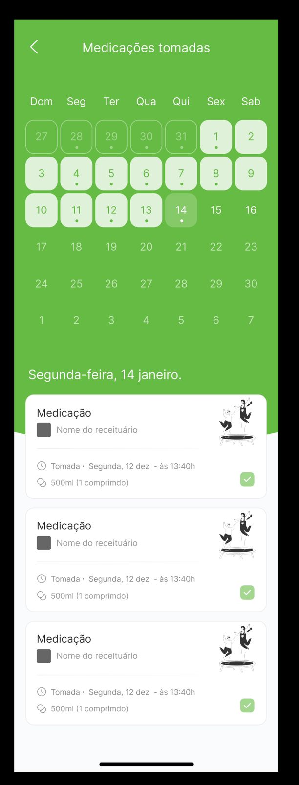
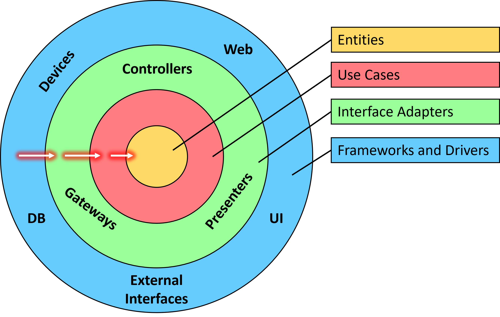
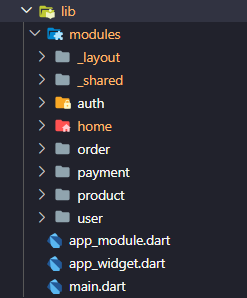
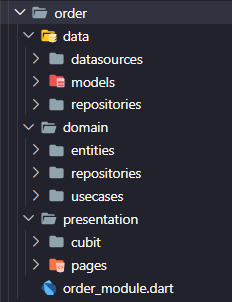
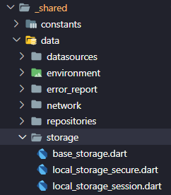
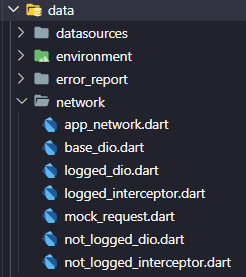
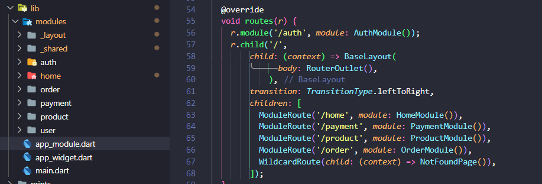

# Teste Calendar 

A ideia eh replicar a tela abaixo, usando dados coletados de uma API usando arquitetura Clean. 

  

---
    

### ✔️ Topicos abordados  
 - Clean Arch - arquitetura
 - Calendar - elementos de tela
 - REST API - dados do backend
 - GoRouter - navegacao
 - Get It - injecao de dependencias
---
   

 

## 🧩 Arquitetura Limpa
Arquitetura Limpa é uma abordagem para projetar sistemas de software que enfatiza a organização do código em camadas bem definidas, tornando o software mais modular, testável e fácil de manter.
Além disso, a Arquitetura Limpa promove a aplicação de princípios como o Princípio da Responsabilidade Única (Single Responsibility Principle) e o Princípio da Inversão de Dependência (Dependency Inversion Principle) para criar sistemas flexíveis e de alta coesão

 

  

Para saber mais sobre arquitetura limpa: 
- [Um bom artigo sobre o tema](https://betterprogramming.pub/the-clean-architecture-beginners-guide-e4b7058c1165)
- [Outro bom artigo](https://blog.cleancoder.com/uncle-bob/2012/08/13/the-clean-architecture.html)
 
---
  

## 🏷️ Modulos e Organização das Camadas
A ideia de uso dessas abordagens pode parecer de inicio muito complicada e que espalha código em centenas de arquivos e pastas. 
Mas na verdade uma solução que utlize modularização e arquitetura limpa faz sentido em uma aplicação com os seguintes requisitos:
- Escalavel: entende-se que haverá novas funcionalidades
- Teste: precisa ser simples a automatização dos testes  
- Times: haverá alguns grupos de pessoas trabalhando no mesmo código
- Aproveitamento: re-utilização de modulos de outros projetos (ex: shared, auth, profile) 
- MicroApp: facilita a conversao para micro-apps, cada modulo pode se tornar um pacote. 

Modulos/Functionalidades  / Pastas das Camadas / Modula Compartilhado

 

   
   
   

Abaixo um exemplo, o modulo de Produto. Navegação e injeção de dependencias:
Ao acessar uma tela/pagina de um modulo, as dependencias são carregadas conforme a necessidade. Ao sair da tela as dependencias serão removidas da memória.

 
Note que um modulo pode conter diversas paginas, e ate sub-modulos se necessario. 
  

Para dependencias mais básicas, compartilhadas por todos os modulos, pode ser descritas e expostadas no conceito 'Core Module'. Note que se trata de classes como http, local storage, shared navition (centraliza chamadas de navegacao, para que a navegacao do Modular seja desacoplavel): 

---
  

## 🛠️ Estruturas Compartilhadas e Desacoplamento
Os modulos com o _ (underscore) em seu nome são modulos que atendem aos demais modulos. A ideia é centralizar as dependencias principais de forma que possam ser trocadas facilmente, o chamado desacoplamento. 

 
 

As camadas inferiores injetam dependecias atraves de suas classes abstratas, tornando simples a substituição de pacotes como Dio para requisições http ou SharedPreference para armazenamento de dados local. 

### Layouts e Menu
Outro exemplo de modulo é independente mas que seu uso só faz sentido para atender a outros modulos, é o modulo _layout. 

O flutter Modular apresenta uma funcionalidade chamada RouterOutlet para que exista uma navegação aninhada, a troca de tela deve se dar em um espaço especifico do layout. Veja abaixo como fica definida a navegação entre as rotas de cada modulo e a composicao com o layout comun entre elas. 

 

Note que a tela de autenticacao (rota /auth) na comportilha o layout com as demais rotas. 

---
  

## 👍🌟 Gostou? 
Se gostou, se achou util, fique a vontade para: 
- Deixar uma estrela. 
- Entrar em contato.
- Contribuir com 'pull request'. 
- Clonar o repositorio.

---
  

#
<footer>
  
 Copyright © Moacir Jacomin 

